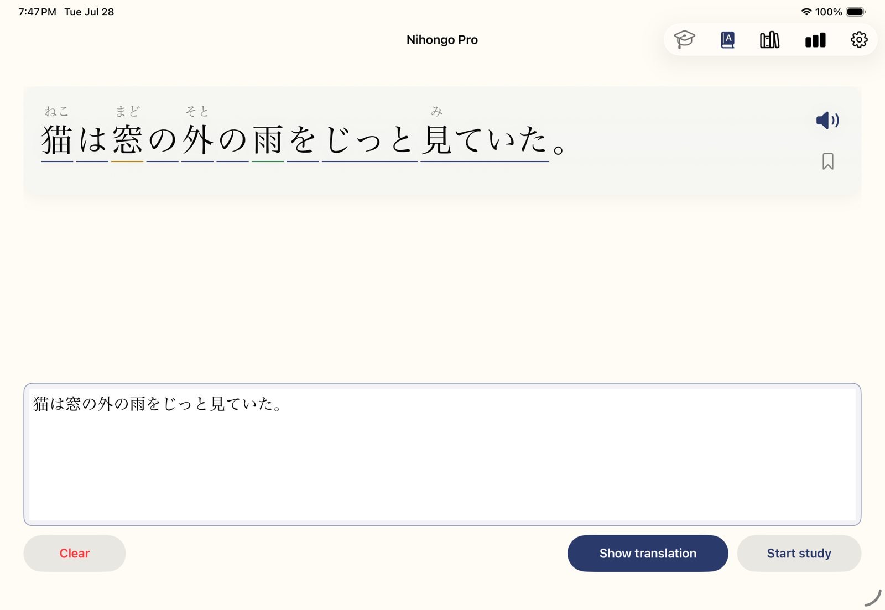
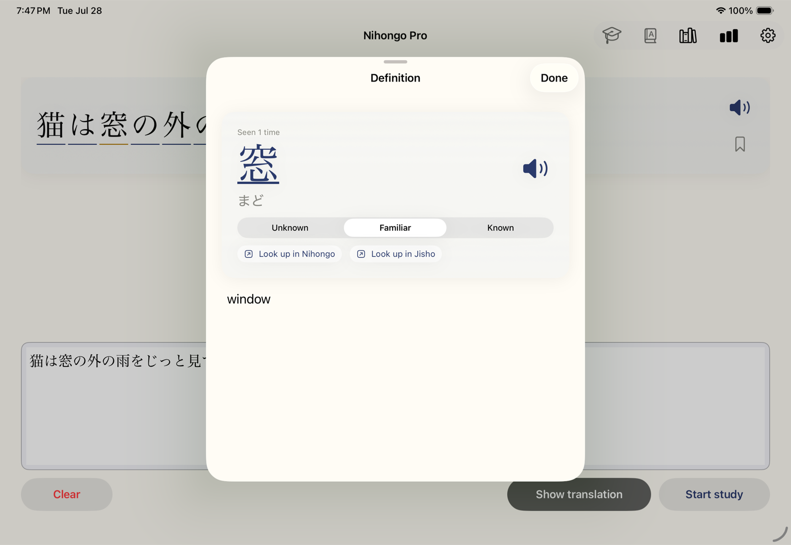
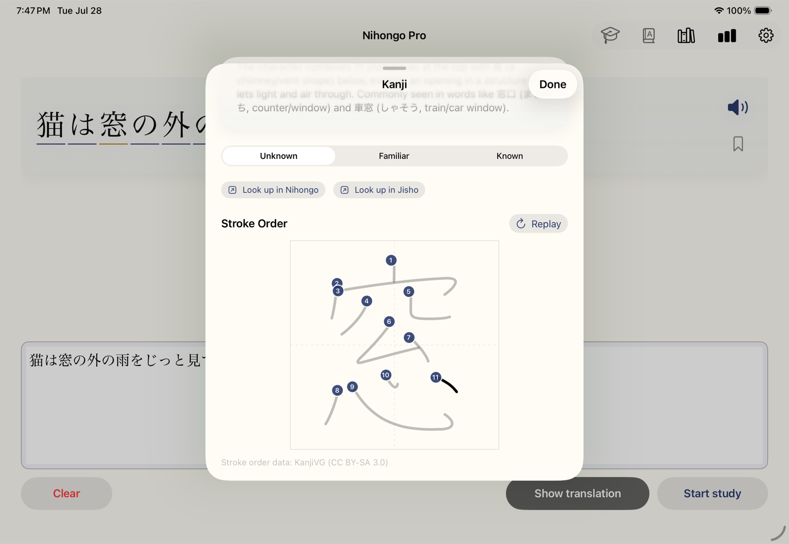
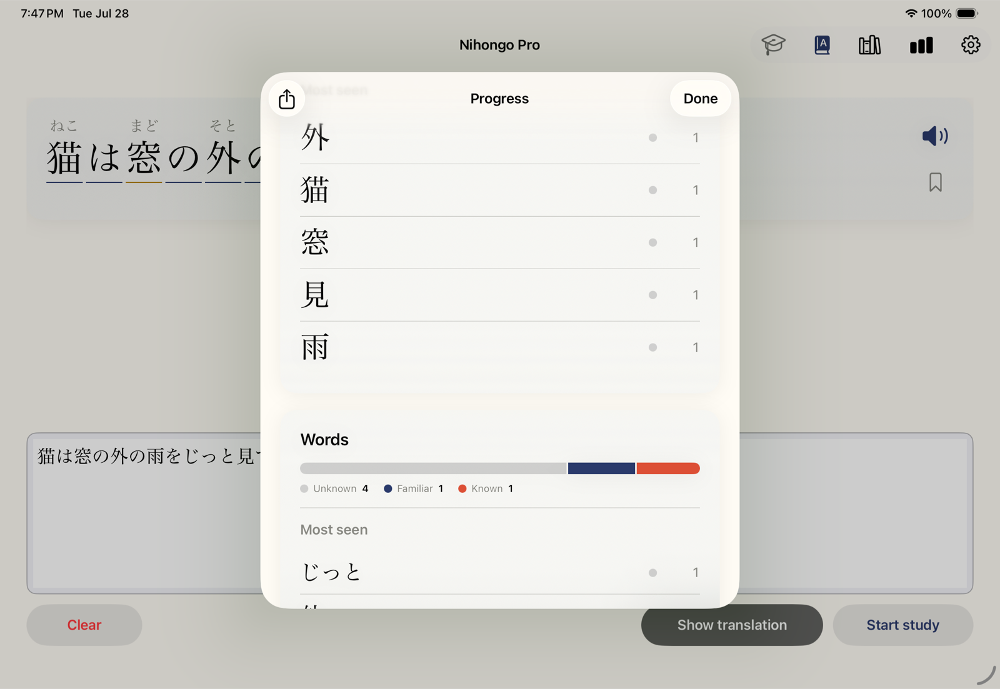

# Nihongo Pro

A Japanese-study app for **iPad and iPhone**. Paste a Japanese sentence — or a few short ones, like a manga speech bubble — and see it back instantly: tap any word for its meaning, try to understand it yourself, then tap **Show translation** to reveal the natural English when you're ready. Toggle **furigana** on top of the kanji whenever you need a reading hint.

Translation and furigana are powered by your choice of **Claude** (Anthropic) or **ChatGPT** (OpenAI) using your own API key — see [API keys](#api-keys) below. Keys are stored in the device Keychain and never leave the device except to call the provider you've selected.

> **Source-available, not open source:** you're free to read, learn from, fork, modify, and build this app for your own personal use — but commercial use and app-store distribution are not permitted. See [License](#license).

## Screenshots

| Parsed sentence — furigana & knowledge markup | Word definition |
| :---: | :---: |
|  |  |

| Kanji detail — animated stroke order | Progress |
| :---: | :---: |
|  |  |

## Features

- **Study-first flow** — the Japanese renders first; the English hides behind a **Show translation** button, with an optional **literal, grammar-following translation** one more tap away.
- **Tap-to-define** — tap any word for its kana reading and a contextual English definition; tap any kanji inside that sheet for meanings, on'yomi/kun'yomi, its JLPT level, a memorable note, and an **animated stroke-order diagram** ([KanjiVG](https://kanjivg.tagaini.net) data).
- **Toggleable furigana** — off by default so you practice reading unaided; words and kanji you've marked Known stay un-furigana'd even when it's on.
- **Familiarity levels & knowledge markup** — rate every word and kanji Unknown / Familiar / Known; the sentence display color-codes what you know, live (green Known, amber Familiar), including in drill mode.
- **Reading drill mode** — hides all furigana and turns each word into a tap-to-reveal reading quiz.
- **Breakdown view** — a full study view per sentence: Vocabulary, Grammar, Sentence structure, and Notes.
- **Spoken Japanese** — on-device TTS, or an optional [Azure Speech](https://portal.azure.com) neural voice (bring your own key; the free tier vastly covers personal study). Tricky rare compounds are spoken from their analyzed reading so they're pronounced right; everything else stays natural kanji for good prosody.
- **Saved sentences** — bookmark any parsed sentence with its full parse baked in; reopens instantly and offline.
- **Progress & streaks** — exposure counts for every word and kanji, familiarity distributions, top-25 most-seen lists, a day streak, and a last-14-days study chart. One-tap JSON export of everything as a backup.
- **Pomodoro study timer** — a single 25-minute work / 5-minute break cycle with a ticking toolbar pill and a hard-to-miss chime.
- **iCloud sync** — progress syncs between your iPad and iPhone via CloudKit (no server); counts merge additively so nothing is lost studying offline on both.
- **External dictionary handoff** — jump any word or kanji into the [Nihongo](https://apps.apple.com/us/app/nihongo-japanese-dictionary/id881697245) app or [Jisho.org](https://jisho.org).
- **No third-party dependencies** — pure SwiftUI + system frameworks.

## Requirements

- Xcode 26 or newer
- An iPad or iPhone (or simulator) running iPadOS / iOS 26 or newer
- An [Anthropic API key](https://console.anthropic.com/) (an [OpenAI key](https://platform.openai.com/api-keys) works as an optional fallback provider) — see [API keys](#api-keys)
- An Apple ID for code signing. A free personal team builds and runs the app, but **iCloud sync requires a paid Apple Developer Program membership** (the iCloud/CloudKit capability isn't available on free teams). Without it, the app still works fully — just per-device with no sync.

## Build & run

1. Clone the repo and open it in Xcode:
   ```bash
   git clone https://github.com/tad/nihongo-pro.git
   cd nihongo-pro
   open NihongoPro.xcodeproj
   ```
2. Select the **NihongoPro** target → **Signing & Capabilities** → pick your **Team**. (No team is committed in the project — you must select your own or the build will fail with a signing error.)
3. Choose a destination — an iPad (e.g. iPad Pro 13″) or an iPhone running OS 26 — and press **Run** (⌘R).

**If you fork this for your own use:** change the bundle identifier (`com.terrydonaghe.NihongoPro`) to your own, and — if you want iCloud sync — the CloudKit container identifier in `NihongoPro/NihongoPro.entitlements` to match (`iCloud.<your bundle id>`). Both devices must be signed into the same iCloud account for sync; if you're signed out of iCloud, the app runs fully on local data.

## API keys

The app is bring-your-own-key. All keys are entered in-app (Settings, gear icon), stored in the iOS Keychain on-device, and sent only to their respective service.

| Key | Required? | Where to get it | Cost |
| --- | --- | --- | --- |
| **Anthropic** (Claude) | Yes — the default provider | [console.anthropic.com](https://console.anthropic.com/) → API Keys | Pay-as-you-go. A sentence parse costs a fraction of a cent; heavy daily study is pennies per day. |
| **OpenAI** (ChatGPT) | Optional — a fallback provider | [platform.openai.com/api-keys](https://platform.openai.com/api-keys) | Comparable pay-as-you-go pricing. |
| **Azure Speech** | Optional — premium voice | [portal.azure.com](https://portal.azure.com) → create a *Speech service* resource, copy a key + region (e.g. `westus2`) | Free tier: 500,000 characters/month — vastly more than personal study uses. |

**OpenAI is optional.** Claude is the default provider and all the app needs is an Anthropic key. The OpenAI key exists as a fallback option: if you'd rather not use Claude (or want to switch), flip the **AI Provider** picker at the top of Settings to **ChatGPT** and all AI calls (translations, definitions, kanji info, breakdowns) route there instead. Note the switch is manual — the app doesn't automatically fail over between providers. You only need a key (and a small prepaid credit balance) for the provider you actually select.

**Azure Speech is optional too.** Without it, the app speaks with the built-in on-device Apple voice — no key, no cost, works offline. Add an Azure key only if you want the premium neural voice; if Azure is ever unreachable the app automatically falls back to the on-device voice. That said, I've found Azure Speech to be the best Japanese voice for this app — it's the most accurate with kanji readings and the most natural to listen to, and the free tier makes it effectively free for personal study.

On first launch the Settings sheet appears automatically — paste your Anthropic key (starts with `sk-ant-…`) and tap **Save**, or enter an OpenAI key in its own section and switch the provider. You can change or remove keys any time via the gear icon.

## Using it

1. Paste some Japanese into the text box at the bottom — one sentence or a few short ones, like a manga speech bubble. Input is limited to 200 characters; a quiet running counter appears under the box once you pass 150.
2. About a second after you stop typing, the sentence renders at the top alongside a speaker button. Tap the speaker to hear the Japanese (or flip on **Read sentence aloud automatically** in Settings — off by default). Definitions load in a second background pass; once they arrive, words become underlined and tappable. Furigana is off by default — the **book icon** in the toolbar toggles hiragana readings above the kanji.
3. **Tap any underlined word** for its kana reading and English meaning, with a speaker button for just that word. Inside that sheet, tap any kanji to drill into meanings, readings, a note, and an animated stroke-order diagram. Both sheets have **Look up in Nihongo / Jisho** handoff buttons and an Unknown / Familiar / Known rating control.
4. Try to understand the sentence yourself, then tap **Show translation** to reveal the natural English. A small **Show literal translation** button under it reveals a grammar-following rendering (topic first, verb last) that shows *how* the Japanese is built.
5. Tap **Breakdown** (appears after the reveal) for the full study view: translation, Vocabulary, Grammar, Sentence structure, and Notes.
6. Tap the **bookmark** on the sentence card to save it with its full parse; the **books icon** in the toolbar opens your library — tap to reload, swipe to delete. **Clear** (bottom left) wipes everything for a fresh sentence.
7. The **graduation-cap icon** enters reading-drill mode: furigana hidden, tap a word to reveal just its reading. The **chart-bar icon** opens the **Progress** sheet (stats, streaks, top-seen lists, JSON export via the share icon). **Start study** kicks off a 25-minute pomodoro.
8. Voice options live in Settings → **Voice Engine**: On-device vs Azure, playback rate (Natural / 85% / 65%), and Play Sample. For better on-device voices, download enhanced/premium Japanese voices in iOS *Settings → Accessibility → Spoken Content → Voices → Japanese*, then fully quit and reopen the app. For the Azure engine, paste your key + region, load the Japanese voice list, and pick one (some voices offer speaking styles); audio is cached on-device and the app falls back to the on-device voice automatically if Azure is unavailable.

Example input:
```
今日は良い天気ですね。
```

Example output:
```
   きょう      よ        てんき
   今日 は 良 い 天気 ですね。
```

…and then, after you tap **Show translation**:

```
   ─────────────────────────────
   It's nice weather today, isn't it?

   [ Show literal translation ]
```

…and tapping **Show literal translation** adds the grammar-following rendering:

```
   As for today, (it) is good weather, isn't it?
```

The app is universal: on iPad it keeps the full-width layout; on iPhone (portrait) it adapts — navigation collapses into a **•••** toolbar menu, the action buttons stack vertically, and the Progress grids reflow to two columns. On iPhone, study audio plays even when the ring/silent switch is set to silent.

## Visual identity

A calm Japanese-inspired palette: deep indigo (kon-iro) for the primary accent, warm paper-cream for the background, vermillion (shu-iro) reserved for celebratory accents. Content sits on translucent material cards with soft shadows. Subtle motion: the pomodoro pill ticks its digits, the break overlay scale-fades in. Auto-adapts to dark mode.

## Tech stack

- SwiftUI (universal — iPadOS / iOS 26+), no third-party dependencies; the iPhone layout is gated on device idiom so the iPad UI is unchanged
- Anthropic Messages API (`claude-sonnet-4-6`) or OpenAI Chat Completions API (`gpt-4.1`) via `URLSession` — selectable in Settings
- iOS Keychain (`Security` framework) for API key storage (Anthropic + OpenAI + optional Azure Speech)
- `AVSpeechSynthesizer` (`AVFoundation`) for on-device Japanese TTS, with an optional [Azure Speech](https://portal.azure.com) neural-voice path (`AVAudioPlayer` + on-device MP3 cache)
- `CloudKit` (`CKSyncEngine`, private database) for serverless iCloud sync of progress across devices
- Native SwiftUI stroke renderer (`Path` trim animation on a 109-unit canvas with grid + numbered badges)
- Stroke order SVGs from [KanjiVG](https://kanjivg.tagaini.net) (CC BY-SA 3.0), fetched on demand and cached locally
- Custom SwiftUI `Layout` for furigana flow-wrapping

There's also an optional **Video-Study sync** section in Settings — a two-way familiarity sync with a companion Chrome extension for studying Japanese on Netflix (not yet published). It no-ops silently unless you configure a relay URL and secret, so you can ignore it.

## Contributing

This is a personal study app built for my own daily use — feature direction is mine and there are no support guarantees, but bug reports and small focused PRs are welcome. See [CONTRIBUTING.md](CONTRIBUTING.md) for how to build and what's expected.

## Credits

Stroke order data is provided by the [KanjiVG project](https://kanjivg.tagaini.net) by Ulrich Apel and contributors, released under [Creative Commons BY-SA 3.0](https://creativecommons.org/licenses/by-sa/3.0/). This app fetches individual SVG files on demand and does not redistribute the dataset.

## Privacy

Japanese sentences you translate are sent to your selected AI provider for processing — either Anthropic (subject to [Anthropic's data-handling policies](https://www.anthropic.com/legal/privacy)) or OpenAI (subject to [OpenAI's policies](https://openai.com/policies/)). Nothing is stored on a server controlled by this app, and nothing is sent anywhere else.

## License

Nihongo Pro is **source-available** under the [PolyForm Noncommercial License 1.0.0](https://polyformproject.org/licenses/noncommercial/1.0.0) with an additional app-store restriction. In plain English:

- ✅ You may read, learn from, fork, and modify the code, and build and run the app for your own personal, noncommercial use.
- ✅ You must keep the copyright notice and credit **Terry Donaghe** ([github.com/tad/nihongo-pro](https://github.com/tad/nihongo-pro)) in any copy or derivative.
- ❌ You may not use it, or anything derived from it, commercially — no selling, no paid services, no monetization of any kind.
- ❌ You may not submit it, or anything derived from it, to any app store (Apple App Store, TestFlight, Google Play, etc.) — even for free.

The binding text is in [LICENSE.md](LICENSE.md). The copyright holder retains all rights, including exclusive commercial and app-store distribution rights.
